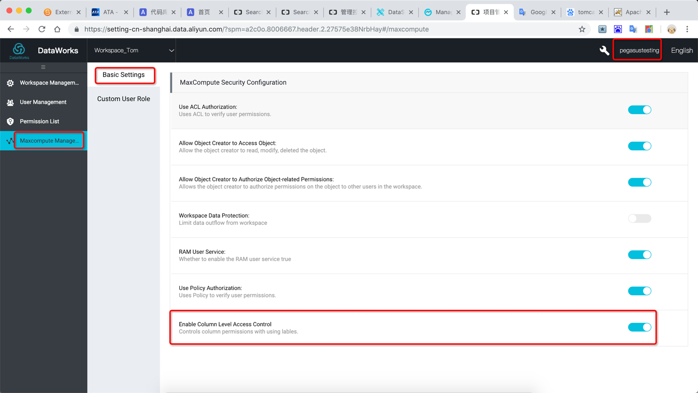
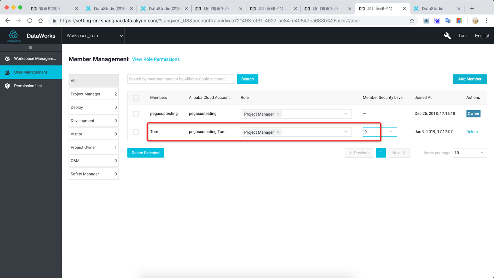

# Practice on Data Permission in Dataworks

## Summary
0. [Introduction](#introduction)
1. [Preparation](#preparation)
2. [Use Cases](#use-cases)

## Introduction
In this document, you will be introduced to the best practices related to data
permissions in [Dataworks](https://www.alibabacloud.com/product/ide). Workspace in Dataworks serves as a container for
solutions and business processes where developers can work on data development
and business flow development. Based on the Alibaba Cloud [RAM service](https://www.alibabacloud.com/product/ram),
multi-member collaboration can be used to develop the same/different solution or
business flow in the same workspace. The project owner can grant different
security levels and data access permissions to members.

This tutorial needs the following organizations, members and data:

| Developer | Workspace       | Role                  | Flow                 | Table     |
|-----------|-----------------|-----------------------|----------------------|-----------|
| Tom       | Workspace_Tom   | Project administrator | Bussiness_Flow_Tom   | table_tom |
| Jerry     | Workspace_Jerry | Project administrator | Bussiness_Flow_Jerry |           |
| Jerry     | Workspace_Tom   | Member, Developer     |                      |           |

The schema of `table_tom` is as follow:

| Column   | Type   | Security Level | Sample Data |               |
|----------|--------|----------------|-------------|---------------|
| id       | BIGINT | 0              | 1           | 2             |
| username | STRING | 1              | Tom         | Jerry         |
| password | STRING | 2              | 12345678    | abcdefg       |
| address  | STRING | 3              | Xixi campus | Apsara campus |
| phone    | STRING | 4              | 18900010001 | 13200020002   |

## Preparation
1. Prepare RAM account for Tom and Jerry, follow
     [this documentation](https://www.alibabacloud.com/help/doc-detail/74248.htm) to do it.
    
     > Note: this document describes the steps to create a sub-account, enable console logon,
     > create an access key and add the `AliyunDataWorksFullAccess` permission.

2. Create workspaces in DataWorks with RAM account Tom and Jerry individually.

      2.1 Connect to the [DataWorks console](https://workbench-intl.data.aliyun.com/consolenew) with Tom's account and
          create the workspace `Workspace_Tom`.

      > Note 1: for each user, set "Identity to Access MaxCompute" to "Private Account".
     
      > Note 2: for more information about the regions, please
      > [read this document](https://www.alibabacloud.com/help/doc-detail/40654.htm).

      > Note 3: connecting to the web console via a RAM user requires a specific URL. You can obtain it with the
      > master account by navigating to the [RAM dashboard console](https://ram.console.aliyun.com/#/overview) and by
      > copying the "RAM User Logon Link" (e.g. http://signin-intl.aliyun.com/6927306411770866/login.htm).

      

      2.2. Do the same operation with Jerry's account to create the workspace "Workspace_Jerry".

3. Connect to the [DataWorks console](https://workbench-intl.data.aliyun.com/consolenew) with the master's account,
   click on the "Workspaces" tab and click on `Workspace_Tom`. A new web browser tab should open and display
   the "DataStudio" IDE. Click on the wrench icon (with the "Workspace Manage" tooltip) and select the
   "Maxcompute Manage..." item in the left menu. You can now enable the "column-level access control".

     

4. Connect to the [DataWorks console](https://workbench-intl.data.aliyun.com/consolenew) with Tom's account and go to
   the `Workspace_Tom`.

5. Create a business flow `Business_Flow_Tom`, [a table](https://www.alibabacloud.com/help/doc-detail/84670.htm)
   `table_tom` and set the security level for columns.

    

6. [Create a query](https://www.alibabacloud.com/help/doc-detail/74428.htm) to insert some records for testing:

     ```sql
     INSERT INTO table_tom values (1,'Tom','123456','xixi campus','18900010001');
     INSERT INTO table_tom values (2,'Jerry','123456','apsara campus','13200020002');
     ```

## Use Cases
1. Tom’s member security level is 0.

    

2. Tom uses SQL statement to query `table_tom` data – Fail.

    

3. Set Tom’s member security level to 2.

    

4. Tom uses SQL statements to query data with column security levels 0 and 1 – Successful.

    

5. Tom uses SQL statements to query data with column security levels 0,1,2 and 3 – Fail.

    

6. Set Tom’s member security level to 9(highest).

    

7. Tom uses the SQL statement to query the data of all columns of `table_tom` – Successful.

    

8. Tom adds Jerry as a member of the `Workspace_Tom` and as a development role, the default member security level is 0.

    

9.  Jerry, as the developer of the `Workspace_Tom`, uses the SQL statement to query the data of all the columns of the `table_tom` – Fail.

    

10. Tom sets Jerry's member security level in `Workspace_Tom` to 2.

    

11. Jerry, as a developer of `Workspace_Tom`, uses SQL statements to query data in columns with security levels 0 and 1 in `table_tom` – Successful.

    

12. Jerry, as a developer of `Workspace_Tom`, uses SQL statements to query data in
    columns with security levels 0,1,2 and 3 in `table_tom` – Fail.

    

13. Jerry has a member security level of 2 in `Workspace_Tom`, it queries the data
    of all columns in `table_tom` through SQL statements in Workspace_Jerry – Fail.

    

14. Jerry has a member security level of 2 in `Workspace_Tom`. In Workspace_Jerry,
    query the data in `table_tom` with security levels 0, 1 and 2 through SQL
    statements – Successful.

    

15. Jerry has a member security level of 2 in `Workspace_Tom`, previewing
    `table_tom` data through [Data Management](https://www.alibabacloud.com/help/doc-detail/73836.htm) page – Fail.
    
    > Note: to switch from the DataStudio IDE to Data Management, click on the DataWorks icon on the top left.

    

16. Jerry applies for access permissions with security levels 3 and 4 in
    `table_tom`.

    

17. Tom approves Jerry’s application for data access permission.

    

18. Jerry’s member security level is 2 and have permissions to access columns whose security level is 3 and 4. Preview data in Data Management – Successful.

    

19. Jerry’s member security level is 2 and have permissions to access columns
    whose security level is 3 and 4. Jerry queries the data of all columns of
    `table_tom` through SQL statements in Workspace_Jerry – Successful.

    

20. Modify Jerry’s member security level in `Workspace_Tom` to 0.

    

21. Jerry’s member security level is 0 but have permission to access columns of
    `table_tom` whose security is 3 and 4. Preview data in Data Management -
    Fail.

    

22. Tom take back Jerry’s access permission application of columns.

    From now on, Jerry’s member security level of `Workspace_Tom` is 0 and has no
    permission to any column of `table_tom`.

    

23. Jerry previews `table_tom` data on Data Management page – Fail.

    

24. Jerry queries the data of all columns of `table_tom` through SQL statements in
    Workspace_Jerry - Fail.

    

25. Tom removes Jerry from `Workspace_Tom`.

    

26. Tom applies for Jerry's data access permissions in `table_tom` with security levels 1 and 3, then approve his own
    application.

    

27. Jerry queries the data of id, username, and address in `table_tom` through the SQL statement in Workspace_Jerry – Successful.

    

28. Jerry queries the data of id, username and password in `table_tom` through the
    SQL statement in Workspace_Jerry – Fail.

    

29. Jerry queries the data of id, username and phone in `table_tom` through the
    SQL statement in Workspace_Jerry – Fail.

    
